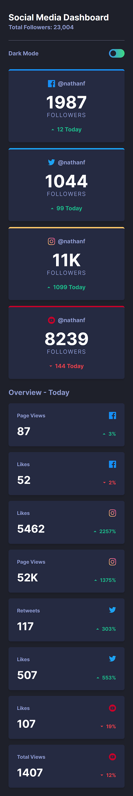

# Frontend Mentor - Social media dashboard with theme switcher solution

This is a solution to the [Social media dashboard with theme switcher challenge on Frontend Mentor](https://www.frontendmentor.io/challenges/social-media-dashboard-with-theme-switcher-6oY8ozp_H). Frontend Mentor challenges help you improve your coding skills by building realistic projects.

## Table of contents

- [Overview](#overview)
  - [Screenshot](#screenshot)
  - [Links](#links)
- [My process](#my-process)
  - [Built with](#built-with)
  - [What I learned](#what-i-learned)
- [Author](#author)

## Overview

### Screenshot

### Links

- Solution URL: [Github Repo](https://github.com/to-my-learning-path/social-media-dashboard)
- Live Site URL: [Github Pages](https://to-my-learning-path.github.io/social-media-dashboard)

## My process

### Built with

- Semantic HTML5 markup
- CSS custom properties
- Flexbox
- CSS Grid
- Mobile-first workflow
- [React](https://reactjs.org/) - JS library
- Typescript
- [Tailwindcss](https://tailwindcss.com/) - CSS framework
- [HeadlessUI](https://headlessui.com/)

### What I learned

I learned how to implememt dark mode in react app using tailwindcss

## Author

- Frontend Mentor - [@Omar](https://www.frontendmentor.io/profile/to-my-learning-path)
